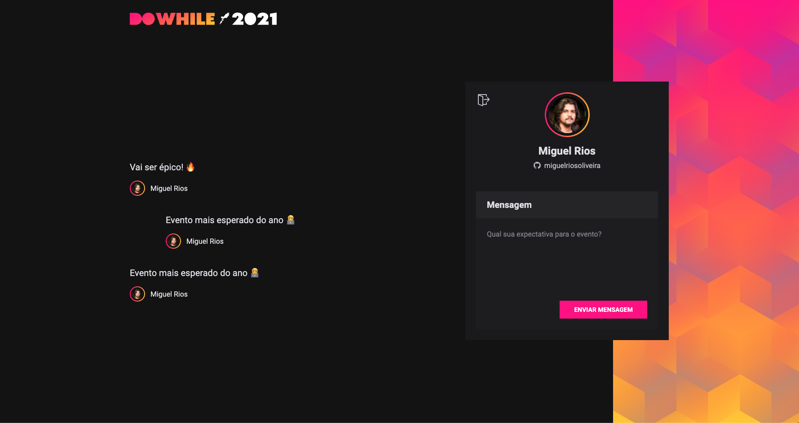
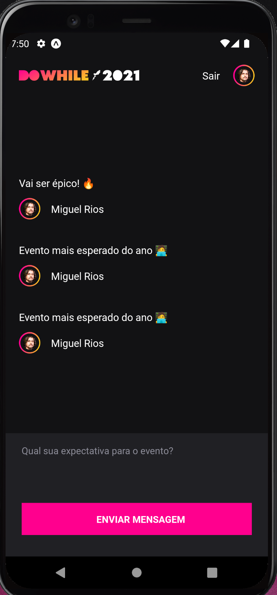

<p align="center">
   
</p>

<p align="center">	
   <a href="https://www.linkedin.com/in/miguelriosoliveira/">
      
   </a>

  

  <a href="https://github.com/miguelriosoliveira/dowhile-mural/commits/main">
    
  </a>

  
</p>

> :rocket: Full-stack project made so developers can share their thoughts about an upcoming event. Made during the Next Level Week Heat (NLW Heat) #07 by Rocketseat.

<div align="center">
  <sub>The NLW #07 project. Built with ❤︎ by
    <a href="https://github.com/miguelriosoliveira">Miguel Rios</a>
  </sub>
</div>

# :pushpin: Table of Contents

- [Technologies](#computer-technologies)
- [Features](#rocket-features)
- [How to Run](#construction_worker-how-to-run)
- [License](#closed_book-license)

### Web Screenshots

<div>
   
</div>

### Mobile Screenshots

<div>
   
</div>

# :computer: Technologies

This project makes use of the follow technologies:

[](https://www.typescriptlang.org/)
[](https://expressjs.com/)
[](https://socket.io/)
[](https://vitejs.dev/)
[](https://expo.io/)

# :rocket: Features

- Website to sign up using GitHub account and post and read thoughts about the upcoming event in real time.
- App to do the same things, but in a mobile view.
- Elixir microservice to generate a word cloud from the posts added by the users.

# :construction_worker: How to run

### 📦 Run API

```bash
# go to server folder
$ cd server

# install dependencies
$ yarn

# run application
$ yarn dev
```

Access API at http://localhost:4000

### 💻 Run Web Project

```bash
# go to web folder
$ cd web

# install dependencies
$ yarn

# run application
$ yarn dev
```

Go to http://localhost:3000 to see the result.

### 📱 Run Mobile Project

To run the mobile project you need a cellphone with the [expo](https://play.google.com/store/apps/details?id=host.exp.exponent) app installed or a android/ios emulator.

```bash
# go to mobile folder
$ cd mobile

# install dependencies
$ yarn

# run application
$ yarn start
```

After this, read the QRCode with the expo app or run on your emulator.

### 📱 Run Word Cloud microservice

```bash
# go to tags_service folder
$ cd tags_service

# install dependencies
$ mix deps.get

# run application
$ mix phx.server
```

Access microservice at http://localhost:4000

# :closed_book: License

This project is under the [MIT license](./LICENSE).

Made with love by [Miguel Rios](https://github.com/miguelriosoliveira) 🚀 • Give a ⭐️ if this project helped you!
