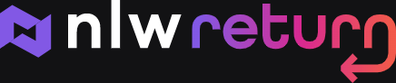
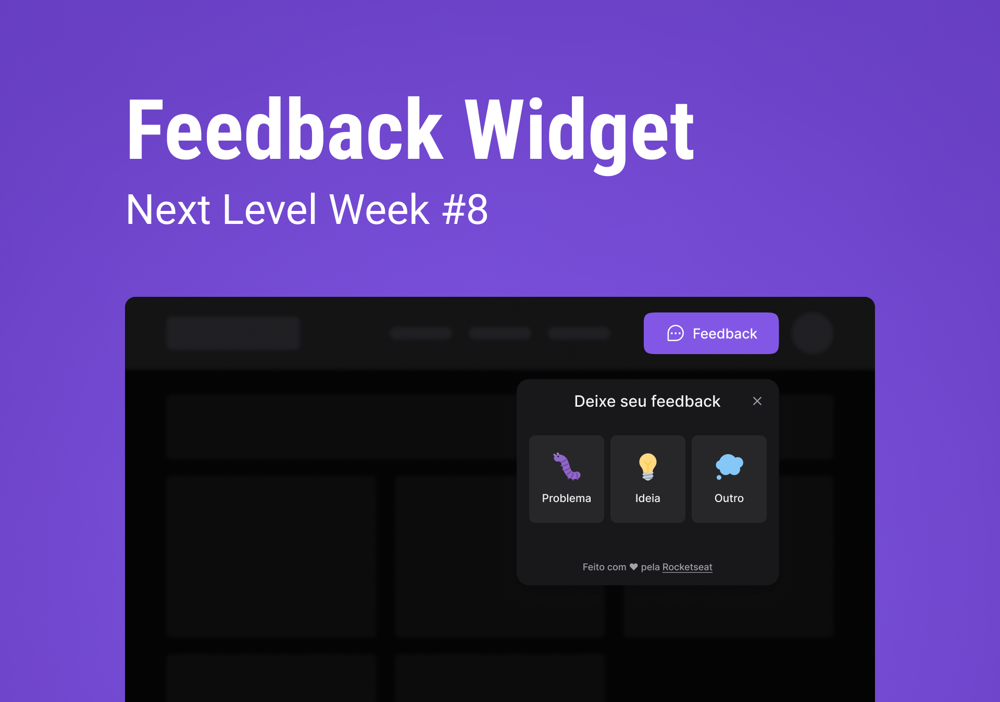

   
    
   

	
   

  

  

  

> :rocket: Feedback widget made so anyone can share their suggestions and/or complains on any website. Made during the "Next Level Week #08 - Return" (NLW #08 - Return) by Rocketseat.

  The NLW #08 project. Built with ❤︎ by
    <a href="https://github.com/miguelriosoliveira">Miguel Rios</a>
  

# :pushpin: Table of Contents

- [Technologies](#computer-technologies)
- [License](#closed_book-license)

# :computer: Technologies

This project makes use of the follow technologies:

# :closed_book: License

This project is under the [MIT license](./LICENSE).

Made with love by [Miguel Rios](https://github.com/miguelriosoliveira) 🚀 • Give a ⭐️ if this project helped you!
