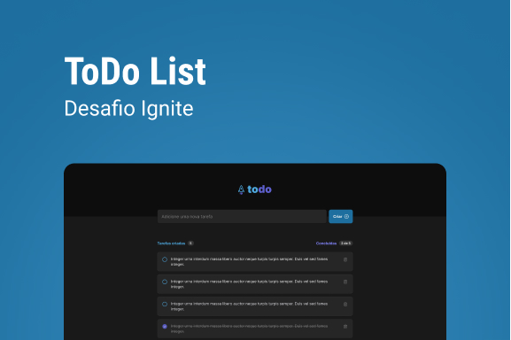

# todo

Clássica aplicação ToDo List, para criação e organização de itens a fazer.

Primeiro desafio do curso Ignite, trilha React 2022.

# Rodar a Aplicação

`yarn` - Instalar as dependências da aplicação.

`yarn dev` - Rodar a aplicação.